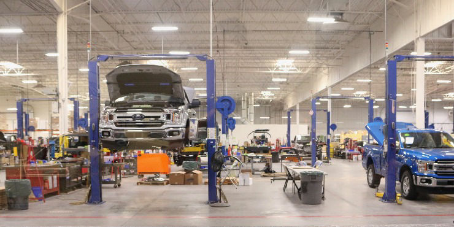
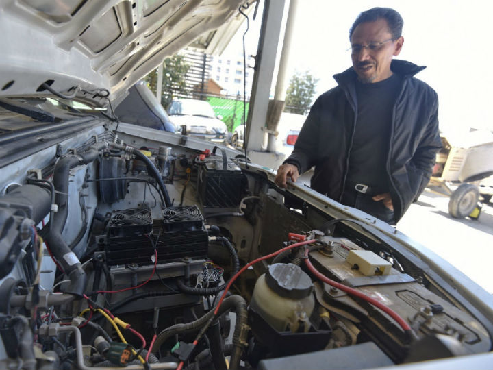

<html lang="en">

<head>
    <meta charset="UTF-8">
    <meta http-equiv="X-UA-Compatible" content="IE=edge">
    <meta name="viewport" content="width=device-width, initial-scale=1.0">
    <title>MenicosHermanos</title>
    <link href="https://cdn.jsdelivr.net/npm/bootstrap@5.0.2/dist/css/bootstrap.min.css" rel="stylesheet"
        integrity="sha384-EVSTQN3/azprG1Anm3QDgpJLIm9Nao0Yz1ztcQTwFspd3yD65VohhpuuCOmLASjC" crossorigin="anonymous">
    <link rel="stylesheet" href="estilo.css">
</head>

<body>
    <nav class="navbar navbar-expand-lg navbar-dark bg-dark">
        

            <a class="navbar-brand" href="index.html">MecanicosHermanos</a>
            <button class="navbar-toggler" type="button" data-bs-toggle="collapse"
                data-bs-target="#navbarSupportedContent" aria-controls="navbarSupportedContent" aria-expanded="false"
                aria-label="Toggle navigation">
                
            </button>
            

                <ul class="navbar-nav me-auto mb-2 mb-lg-0">
                    <li class="nav-item">
                        <a class="nav-link active" aria-current="page" href="index.html">Inicio</a>
                    </li>
                </ul>
                <form class="d-flex">
                    <input class="form-control me-2" type="search" placeholder="Buscar" aria-label="Search"
                        style="background-color: rgb(118, 219, 228);">
                    <button class="btn btn-outline-warning" type="submit">Buscar</button>
                </form>
            

        

    </nav>
    

        

            <!-- col2 carrousel -->
            

                

                    <!-- Inicio Carrousel -->
                    

                        

                            
                        

                        

                            
                        

                        

                            
                        

                    

                

                

            

            <!-- col3 -->
            

                

                
En Este taller estamos listos y atentos ademas de contar con los activos mas actuales para desempear
                    elmejor trabajo posible.

                
 
                

                    Existe una garantia y un seguro de robo, choque, etc ademas de brindar sistema gps que viene junto
                    con
                    el servicio de sufiro que entregamos
                

                
 
            

            

                

                
 Cualquier duda no dude en contactarnos en nuestro correo: tallermecanico251@gmail.com

                
 
                
Tambien puede contactenos al wattsap que esta activo 24/7: +56 9 8662 2381

                
 
            

            <table>
                <tr>
                    <th>
                        

                            <h2>Galeria de Arte,Esculturas,Orfebrería y Tejids</h2>
                        

                    </th>

                </tr>
                <tr>
                    

                        

                            

                                
                                

                                    <h5 class="card-title">trabajo 0</h5>
                                    
Some quick example text to build on the
                                        card
                                        title and make up the bulk of the card's content.

                                    <a href="#" class="btn btn-primary">Go somewhere</a>
                                

                            

                </tr>
                

                <tr>
                    

                        
                        

                            <h5 class="card-title">Trabajo1</h5>
                            
Some quick example text to build on the card
                                title and make up the bulk of the card's content.

                            <a href="#" class="btn btn-primary">Go somewhere</a>
                        

                    

                </tr>
                

                <tr>
                    

                        
                        

                            <h5 class="card-title">Trabajo2</h5>
                            
Some quick example text to build on the card
                                title and make up the bulk of the card's content.

                            <a href="#" class="btn btn-primary">Go somewhere</a>
                        

                    

                </tr>
                

                <tr>
                    

                        
                        

                            <h5 class="card-title">Trabajo3</h5>
                            
Some quick example text to build on the card
                                title and make up the bulk of the card's content.

                            <a href="#" class="btn btn-primary">Go somewhere</a>
                        

                    

                </tr>
                <tr>
                    

                        
                        

                            <h5 class="card-title">Trabajo4</h5>
                            
Some quick example text to build on the card
                                title and make up the bulk of the card's content.

                            <a href="#" class="btn btn-primary">Go somewhere</a>
                        

                    

                </tr>
            </table>
        

    

    
    
    
</body>
